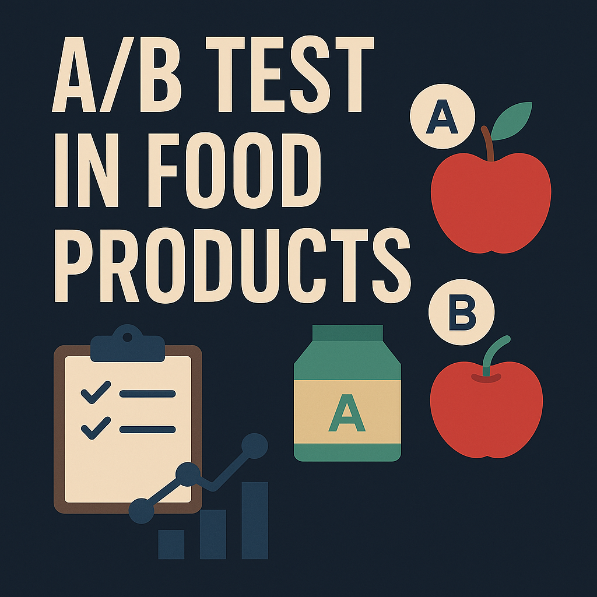

# Data Analyst

#### Technical Skills: Python, SQL, Power BI, Tableau, Excel.

## Education
- Data Analyst | TripleTen (_October 2025_)								       		
- Industrial Engineer	| Universidad de la Costa (_December 2021_)

## Projects
### Inefficient Operator Identification – CallMeMaybe
[Publication](https://github.com/JDavidSA/Inefficient_Operator_Identification) 

This project aims to support the virtual telecom company CallMeMaybe in detecting underperforming operators through statistical and data analysis using Python.
It includes end-to-end data cleaning, transformation, exploratory data analysis, and hypothesis testing to validate findings and improve service quality.

  

### YouTube Trending History Analysis
[Publication](https://github.com/JDavidSA/YouTube-Trending-History-Analysis)

Data-driven analysis of YouTube’s historical trending videos to uncover consumption patterns by category and country, aimed at informing advertising campaign planning (audience targeting, budget allocation, and content mix).

  

### A/B Test in Food Products
[Publication](https://github.com/JDavidSA/A-A-B-Test-in-Food-Products)

This project analyzes user behavior data from a food delivery company to evaluate the impact of a design change in the app’s product display and navigation.
Using A/B testing and statistical analysis, the study determines whether the modification increased user engagement or conversion.

  

### Used Vehicles Analysis
[Publication](https://github.com/JDavidSA/Used_Vehicles_Analysis)

This is an interactive web application built with Streamlit to explore a dataset of vehicles for sale in the United States.

  

